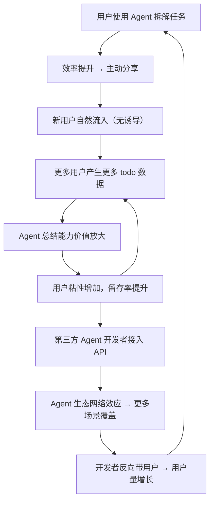
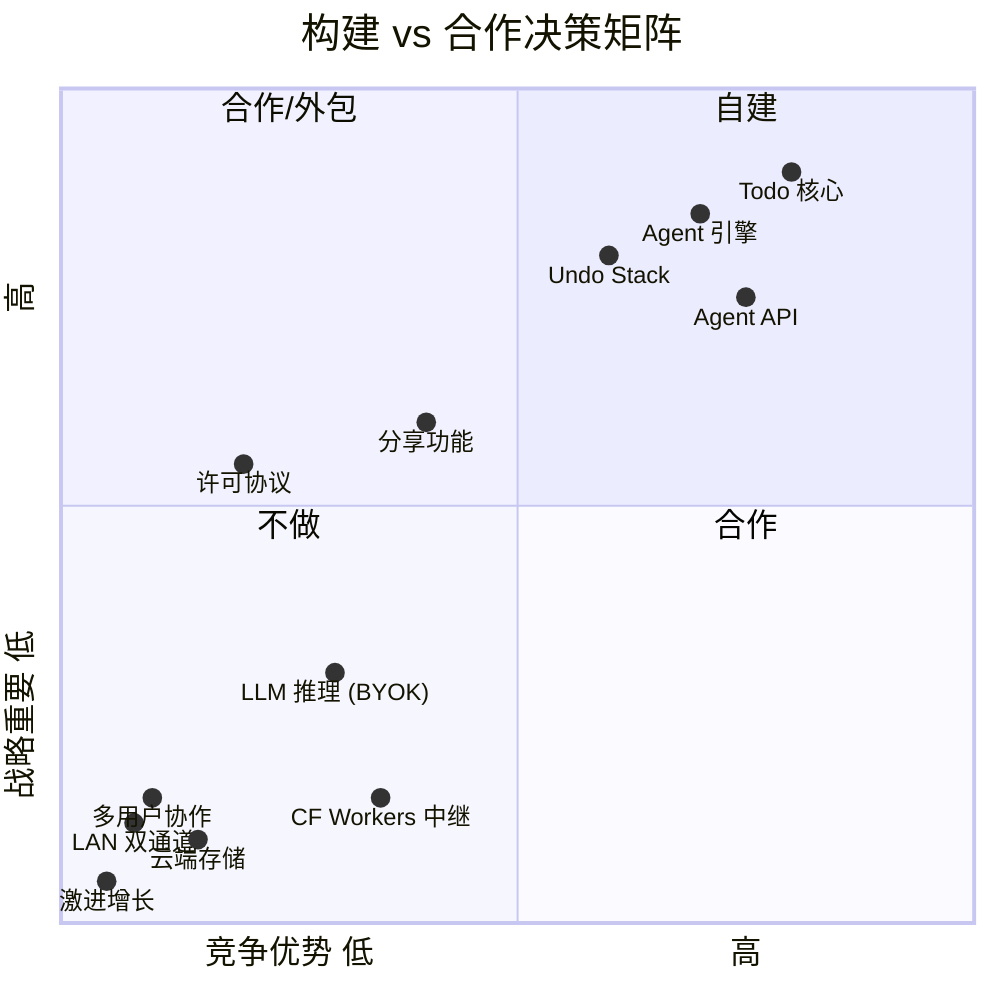
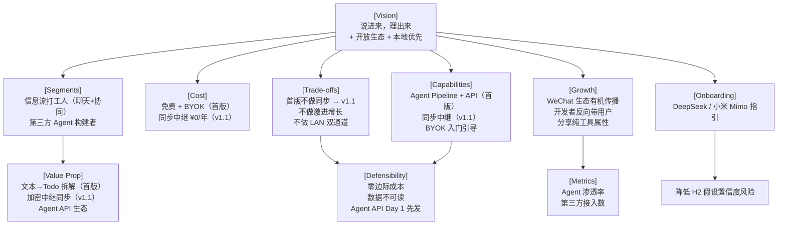

# aknirex-todo 产品策略画布

> 文档版本：v1.5 | 日期：2026-08-02 | 基于 [产品愿景](product-vision.md)
> 修订记录：v1.1 Agent API 首版开放、分享策略、LLM 入门引导 | v1.2 同步方案确认为加密 WebSocket 中继、PC 端确认为微信小程序形态 | v1.3 同步降级为第二版 | v1.4 修正愿景价值观、补全竞品表、细化成本核算、新增 BYOK 风险分析 | v1.5 ASCII 图表改为 Mermaid、核心/完整 MVP 分层

---

## 1. Vision（愿景）

> **"一句话，一件事。说进来，理出来。"**
> *One line, one task. Pour in thoughts, pull out clarity.*

我们不只是做一个 todo 应用。aknirex-todo 是**用户与 AI 之间的任务双向转换器**——把混乱的文字变成清晰的待办，把散乱的待办梳理成有条理的思路。

**我们坚持的价值观**：
- **极简**：GUI 优先，一行字即可创建任务，所有字段都有默认值
- **双向赋能**：不只"记录"，更是"理解和表达"
- **用户主权**：BYOK——用户控制自己的 AI，数据不离开用户设备
- **本地优先**：所有数据存储在用户设备本地，离线全功能可用
- **公平**：自由软件，公平许可，尊重创作者和使用者双方
- **开放生态**：首版即暴露标准接口，第三方 Agent 可无缝接入

> **路线图承诺**：v1.1 将实现端到端加密的跨设备同步（方案已设计），届时"本地优先"升级为"端到端加密隐私"——数据即使在跨设备传输过程中，服务方也无法解密。首版因单设备场景为主，通过本地存储保障隐私。

---

## 2. Market Segments（市场细分）

### 细分逻辑

按 **任务来源场景** 而非人口统计细分。痛点的本质相同：**任务信息以碎片化的自然语言形式涌入，整理成本高昂**。

### 细分 1：信息流打工人（Beachhead Segment）

| 维度 | 描述 |
|------|------|
| **JTBD** | 当我在微信群/钉钉/飞书收到碎片化的任务指令时，我想**瞬间将这些碎片转成可追踪的待办**，以便不漏掉任何任务 |
| **特征** | 日常工作高度依赖即时通讯工具接收任务（领导指示、甲方需求、跨部门协作）。手机和 PC 协同工作，需要在两个设备间无缝切换 |
| **痛点** | 聊天记录里藏着一堆待办，需要反复翻阅查找；手动整理太慢；手机上录入方便但 PC 上查看/整理更高效，缺乏无缝衔接 |
| **为什么是第一个** | 这是**微信小程序的主场场景**——任务在微信（聊天）中产生，用户在微信（小程序）中完成转换，切换成本最低。痛点最"痛"、最频繁、最通用 |

### 细分 2：信息整理需求者

| 维度 | 描述 |
|------|------|
| **JTBD** | 当我手头堆了几十个待办事项、却看不清全局时，我想**让 AI 帮我梳理成清晰的文本**，以便用于汇报、写周报、理清执行思路 |
| **特征** | 需要定期向他人或自己汇报进度，或面对大量任务时需要结构化梳理。同时需要将整理结果分享给他人（发送到群聊、邮件等） |
| **痛点** | 现有 todo 工具只能"看"，不能"讲"——导出为文本需要大量手工整理；分享到微信的路径不顺畅 |
| **次要优先级** | 依赖于已有足够多的 todo 数据后才产生价值（冷启动后） |

### 细分 3：第三方 Agent 构建者

| 维度 | 描述 |
|------|------|
| **JTBD** | 当我的 AI 应用需要操控用户的 todo 列表时，我想**接入一个标准化、开放的任务接口**，以便在自己的 Agent 中集成任务管理能力 |
| **特征** | LLM Agent 开发者（企业内部自动化、个人助手开发者、AI 工作流工具） |
| **痛点** | 现有 todo 工具要么没有 API，要么接口非标准化，要么不允许第三方操控 |
| **首版即支持** | 开放 API 是生态策略的核心——开放的 Agent 生态从第一天起建立，而非事后补课 |

---

## 3. Relative Costs（成本定位）

| 维度 | 策略 |
|------|------|
| **用户成本** | **零价格**（自由软件，免费使用）。对照：Todoist Pro $5/月、TickTick Premium $3/月 |
| **用户"额外成本"** | 用户自带 LLM API Key，需承担少量推理费用（DeepSeek 约 ¥0.001/次、小米 Mimo 约 ¥0.002/次 等） |
| **开发者成本** | **极低运营成本**——无中心数据库、无持续运维。仅需域名、小程序 CDN、应用商店注册费、Cloudflare Workers 免费层（同步中继，¥0/年） |
| **定位** | 类似 Southwest Airlines 的低成本策略，但附加不可替代的 AI 独特价值，形成**免费 + AI + 开放生态 三重壁垒** |

**与竞品成本对比**：

| 产品 | 免费可用 | AI 功能 | 数据存储 | 跨设备同步 | 第三方 API | 提醒通知 | 重复任务 |
|------|----------|---------|----------|------------|------------|----------|----------|
| Todoist | 基础功能 | 付费 | 云端 | ✅ 云端 | ✅ 付费 | ✅ | ✅ |
| TickTick | 基础功能 | 无 | 云端 | ✅ 云端 | ❌ | ✅ | ✅ |
| Microsoft To Do | 完全免费 | 无 | 云端 | ✅ 云端 | ✅ Graph API | ✅ | ✅ |
| Things 3 | 买断 ¥148+ | 无 | 本地 | ❌（仅 Apple ID） | ❌ | ✅ | ✅ |
| **aknirex-todo** | **完全免费** | **内置（BYOK）** | **本地** | **v1.1 加密中继** | **✅ 免费开放** | **v1.1** | **待评估** |

**已知能力缺口（首版）**：

| 缺口 | 影响 | 计划 |
|------|------|------|
| 任务提醒/推送通知 | 用户可能在截止日期前忘记任务 | v1.1 |
| 重复任务 | 日常习惯类 todo（每天/每周）无法自动创建 | 待评估 |
| 自然语言日期解析 | 输入"明天下午3点"不会自动识别日期 | 由 Agent 拆解弥补（文本→Todo 时 AI 可识别时间表达） |

---

## 4. Value Proposition（价值主张）

### 细分 1：信息流打工人

| 要素 | 描述 |
|------|------|
| **What Before** | 在微信里反复上下翻找聊天记录里的任务；手动打字到备忘录或 todo app；经常遗漏口头交代的任务。手机录入、PC 整理时数据不通 |
| **How** | 从微信聊天中复制一段文本（领导指示、甲方需求），粘贴到 aknirex-todo 的 Agent 对话框，**一键拆解为多行结构化 todo**——标题、优先级、标签自动生成。手机录入的任务通过端到端加密中继自动同步到 PC，中继不解密、不存储数据 |
| **What After** | 3 秒完成转录，所有任务有优先级、有标签、可追踪。手机和 PC 看到的永远是同一份数据，不再因"忘了看聊天记录"而遗漏任务。在 PC 上整理完关掉，手机上已是最新状态 |
| **Alternatives** | 手动录入到系统备忘录（无结构化、无 AI）、复制到 Notion/Obsidian 再手工整理（太繁琐且数据上云）、截图保存聊天记录（不可搜索、不可追踪） |

### 细分 2：信息整理需求者

| 要素 | 描述 |
|------|------|
| **What Before** | 面对几十个散乱的 todo，打开笔记本一个一个手动汇总成周报/汇报文本；思路混沌，说不清重点。汇总后还要手动复制到微信/邮件发送 |
| **How** | 选择一个 todo 列表，Agent 自动分析所有条目的标题、优先级、标签、截止日期，**生成连贯的任务汇总文本**。汇总结果可一键导出为文本/文档，或生成分享链接直达小程序 |
| **What After** | 一键获得结构化的任务小结——可直接复制发送到微信聊天、邮件，或分享小程序链接让对方查看。脑子里的混乱被捋顺了，表达也变得清晰 |
| **Alternatives** | 手工整理（耗时 10-30 分钟）、使用 ChatGPT/Claude 手动粘贴 todo 列表并写 prompt（仍需复制粘贴，体验割裂） |

### 细分 3：第三方 Agent 构建者

| 要素 | 描述 |
|------|------|
| **What Before** | 开发一个需要任务管理能力的 AI Agent 时，被迫自建任务数据模型、存储、UI——重复造轮子 |
| **How** | 通过 aknirex-todo 的标准化 Agent API 操控用户的 todo 列表，Agent 专注于推理逻辑，任务管理交给 aknirex-todo |
| **What After** | 开发效率大幅提升，Agent 获得现成的任务 CRUD + 搜索筛选 + 撤销能力。用户数据仍在本地，API 调用不经过任何中心服务器 |
| **Alternatives** | Todoist API（需用户付费）、Microsoft Graph API（绑定微软生态）、自建任务系统（开发周期 2-4 周） |

---

## 5. Trade-offs（取舍）

### 我们选择不做的事

| 不做的事 | 原因 | 带来的聚焦 |
|----------|------|-------------|
| **云端服务器存储/同步** | 增加运维成本、隐私风险、合规负担。**但计划在第二版 (v1.1) 做加密中继同步**——手机微信小程序⇄PC 微信小程序，通过 Cloudflare Workers WebSocket 转发 AES-256-GCM 密文。中继无法解密、不存储。方案已完成设计 | 首版不因同步阻塞发布节奏。先验证核心价值（Agent 拆解/总结），再解决协同体验。方案已就绪，v1.1 可快速实现 |
| **协作/多用户** | 增加复杂度和冲突处理逻辑，稀释"个人效率工具"定位 | 接口简洁，一人即团队 |
| **提供 LLM 推理服务** | 成本不可控，与"免费软件"矛盾；用户应控制自己的 AI | 无服务器成本，用户有完全的模型选择自由 |
| **开源** | 保留对未来商业模式的灵活性（如企业版、高级 Agent 市场） | 避免碎片化分叉，保持产品一致性 |
| **社交功能 / 激进增长手段** | 不做"分享得积分""邀请送会员"等套路。分享功能提供，但完全基于用户自身的实用需求，不做任何增长诱导 | 产品干净，不廉价。用户主动分享是因为产品好用，而非被利诱 |
| **日历视图、甘特图** | 对标项目管理工具而非个人 todo，复杂度越界 | 保持极简，只做"记录 + AI 转化" |
| **iOS（首版）** | 首版聚焦微信小程序（手机 + PC）+ Android App 三大入口 | 资源聚焦，快速验证 |
| **PC 独立桌面应用（首版）** | PC 微信小程序已覆盖 PC 端的核心需求（大屏整理 + 同步），无需额外开发 Electron/Tauri | 一套 UniApp 代码覆盖三端入口，不增加工程复杂度 |
| **同步 LAN 直连通道（首版）** | 加密 WebSocket 中继延迟 < 50ms，用户无感知。双路径切换逻辑引入去重/乱序/重传边界，ROI 低 | 单路径可靠 > 双路径快。首版验证中继体验后，如有真实需求再加 |

### 同步方案（第二版 v1.1，方案已设计）

| 方面 | 决策 |
|------|------|
| **时机** | 首版 (v1.0) 不做同步，第二版 (v1.1) 实现。首版先验证核心价值 |
| **同步范围** | 仅同一用户的设备间（手机微信小程序 ⇄ PC 微信小程序），不做多用户共享 |
| **同步模式** | 加密 WebSocket 中继（Cloudflare Workers + Durable Object）。中继只转发 AES-256-GCM 密文，不解密、不存储 |
| **设备配对** | QR 码交换加密密钥，一次扫码，后续自动重连 |
| **成本** | Cloudflare Workers 免费层——¥0/年 |
| **失败降级** | 无法连接中继时，数据各自本地完整可用，不影响单设备体验。重连后自动追赶差异 |

> 详见 [同步方案设计](sync-design.md)

### "Say No" 的原则

- 一个功能如果不服务于"**快速录入 + AI 双向转换**"的核心循环，原则上不做
- 每个新功能必须通过"一行字能搞定吗？"的极简测试
- 先证明有人在用、有人需要，再扩展
- **分享是用户的工具，不是我们的增长手段**——分享功能的存在是为了帮用户传递信息，不是为了帮我们获客

### MVP 范围风险

当前首版范围（约 12 项核心功能）超过典型 MVP 的"最小可行"标准。如果开发资源紧张，建议按以下顺序砍：

| 保留（核心差异化不可砍） | 可延后 |
|--------------------------|--------|
| Todo CRUD + 完成状态切换 | 多列表管理 → 首版仅"默认列表" |
| 内置 Agent（文本→Todo 拆解） | Agent API → 先内测再开放 |
| 微信小程序（手机） | PC 微信小程序 → 首版仅手机 |
| 全局搜索 | Android App → 二期 |
| 全局撤销 | 全局筛选 → 二期 |
| BYOK 配置 + LLM 入门引导 | 分享功能 → 二期 |
| 许可协议 | Agent（Todo→文本 总结）→ 二期 |

**判断标准**：如果砍完后的版本仍然能验证 H1（用户是否愿意用 Agent 拆解）和 H2（用户是否愿意配 Key），这就是一个合格的 MVP。

---

## 6. Key Metrics（关键指标）

### North Star Metric（北极星指标）

> **每周通过 Agent 处理的 todo 项数**
> *Weekly AI-processed todo items*

- 这个指标直接衡量"任务双向转换器"的核心价值——不是用户自己手动创建的 todo，而是经过 AI 拆解（文本→todo）或 AI 总结（todo→文本）处理的 todo 数量
- 该指标增长 = 用户确实在依赖 AI 完成核心 Job，而非仅当普通 todo 工具使用

> **注意**：此指标有意偏向 AI 使用，因为 NSM 必须衡量差异化——如果选择"每周活跃 todo 项总数"，该指标与 Todoist 无差别，无法衡量"我们是否在提供独特价值"。**但需配合平衡指标**：每周活跃 todo 项总数（含手动和 AI）作为健康度指标，确保手动用户也不被系统性地忽视。

### OMTM（首季度核心指标）

> **活跃用户中，至少使用过一次 Agent 功能的比例（含内置 Agent 和第三方 Agent）**

- 首季度目标是验证 PMF：Agent 是否真正进入用户的工作流？
- 不只是注册量和 DAU——是**Agent 实际使用的渗透率**
- 辅以：7 日留存率、第三方 Agent 接入数（开放生态早期信号）

### 辅助指标

| 指标 | 用途 |
|------|------|
| 日均创建 todo 数 | 评估使用深度 |
| AI 拆解使用率 = 含 AI 创建的 todo / 总 todo | AI 渗透率 |
| 全局撤销使用次数 | 用户信任度（敢操作才敢撤销） |
| 微信小程序（手机）vs Android App DAU 比 | 平台偏好，指导后续资源分配 |
| 人均活跃列表数 | 使用广度 |
| 第三方 Agent 活跃接入数 | 生态早期信号 |

---

## 7. Growth（增长）

### 增长模式：Product-Led Growth（产品驱动增长）

- **无销售团队**：免费软件，无需付费转化漏斗
- **增长引擎**：WeChat 生态有机传播 + 开发者生态拉动

### 分享策略：工具属性优先

**分享是 aknirex-todo 的功能，不是增长手段。**

| 分享方式 | 用途 | 设计原则 |
|----------|------|----------|
| **链接分享**（小程序深度链接） | 用户将某个 todo 列表/汇总结果分享给同事、领导查看 | 接收者点击链接打开小程序查看——但这是"传递信息"，不是"拉新"。链接不带任何推广标记，不带"你也来用吧"文案。接收者查看完如果觉得有用，自然会问"这是什么工具" |
| **导出为文本/文档** | 用户将 todo 汇总导出为 Markdown/纯文本，粘贴到微信聊天、邮件、文档 | 纯粹的输出功能，无任何水印、宣传语、二维码 |
| **截图分享** | 用户截取界面分享到聊天/朋友圈 | 不干涉、不提示、不诱导。用户自发行为，我们不往截图上加水印或营销信息 |

**红线**：绝不做"邀请好友解锁功能""分享得积分""生成带推广码的分享图"等操作。产品的尊严来自好用，不来自增长数字。

### 核心获客渠道

| 渠道 | 优先级 | 策略 |
|------|--------|------|
| **微信生态自发传播** | P0 | 微信小程序天然在聊天场景中——用户从聊天切到小程序 AI 拆解任务，高效的结果驱动自发推荐。链接分享和文本导出都是用户主动使用的工具，自然带来认知 |
| **开发者社区** | P0 | 首版即开放 Agent API。在掘金、V2EX、GitHub 发布 API 文档和示例，吸引第三方 Agent 开发者。开发者是高质量用户来源，且他们会把产品带入自己的用户群 |
| **应用商店自然流量** | P1 | Android 各大应用商店（华为、小米、OPPO、vivo）上架；优化 ASO 关键词（"AI 待办"、"智能任务"、"免费 todo"） |
| **内容营销** | P2 | "AI 时代还需要 todo app 吗？"等主题文章；展示 Agent API 的实用场景 |

### 增长飞轮

### 单位经济（Unit Economics）

| 指标 | 估算 |
|------|------|
| 单用户获取成本（CAC） | ≈ ¥0（渠道以自然传播为主） |
| 单用户年度基础设施成本 | < ¥1（域名 + 小程序 CDN） |
| 单用户 LLM 成本 | ¥0（用户自带 Key） |
| 单用户年度同步中继成本 | ¥0（Cloudflare Workers 免费层） |

→ **CAC + 运营成本接近零，天花板取决于用户规模和生态繁荣度。**

---

## 8. Capabilities（能力）

### 需要构建的核心能力

| 能力 | 方式 | 优先级 | 说明 |
|------|------|--------|------|
| **UniApp 跨端开发**（微信小程序手机 + 微信小程序 PC + Android App） | 自建 | P0 | 一套代码，三端入口覆盖 |
| **本地数据存储与状态管理** (SQLite + Pinia) | 自建 | P0 | 所有 CRUD 操作基于本地数据库 |
| **全局撤销引擎**（多步 Undo Stack，≥50 步） | 自建 | P0 | 跨操作类型统一撤销，操作日志即同步数据源（为 v1.1 同步预留） |
| **LLM API 集成层**（OpenAI 兼容接口，支持 DeepSeek / 小米 Mimo 等） | 自建 | P0 | 适配层抽象不同 Provider 的差异 |
| **Agent 推理 Pipeline**（文本→Todo 拆解、Todo→文本 总结 prompt engineering） | 自建 | P0 | 核心智力资产 |
| **Agent API**（RESTful + API Key 认证 + 限流） | 自建 | P0 | 首版即开放，供第三方 Agent 调用 |
| **LLM 入门引导**（DeepSeek、小米 Mimo 等 API Key 申请与充值指引） | 自建（内容） | P0 | 降低 BYOK 使用门槛 |
| **分享功能**（链接生成 + 文本导出） | 自建 | P0 | 工具属性，无增长诱导 |
| **微信小程序合规与审核** | 自建 | P0 | 个人主体 + AI 类目审核 |
| **Android 打包与多应用商店上架** | 自建 | P0 | 覆盖主流厂商商店 |
| **加密同步中继**（Cloudflare Workers + Durable Object，WebSocket 转发 AES-256-GCM 密文） | 自建（约 150 行 JS） | P1 | v1.1 实现。中继不解密、不存储。方案已完成设计 |
| **QR 码设备配对**（密钥交换 + session 建立） | 自建 | P1 | v1.1 实现。一次扫码，后续自动重连 |
| **许可协议起草** | 合作（律师审查） | P1 | 覆盖软件使用、Agent 生态、用户数据 |

### LLM 入门引导（降低 BYOK 门槛）

针对无 LLM 使用经验的用户，在应用内提供明确的关键提供商指引：

| 提供商 | 引导内容 | 选择理由 |
|--------|----------|----------|
| **DeepSeek** | API Key 申请步骤、充值入口、费用说明（极低价格） | 国内首选——性能强、价格低、申请流程简单 |
| **小米 Mimo** | API Key 申请步骤、额度获取方式 | 小米生态用户便利，集成度高 |
| **OpenAI 兼容接口** | 通用配置方式（base_url + key） | 兼容最多提供商，一次配置可接入多家 |

引导形式：首次使用 Agent 功能时展示友好的"配置你的 AI"引导页，包含上述提供商的图文指引链接，而非直接丢一个技术配置面板。

### 构建 vs 合作决策矩阵

- **自建（右上）**：Todo CRUD、Agent Pipeline、全局撤销、搜索筛选、Agent API、分享功能——产品灵魂
- **合作（右下）**：LLM 推理完全由用户自备 Key（BYOK）
- **合作/外包（左上）**：许可协议——律师审查
- **不做（左下）**：云端数据存储、多用户协作、激进增长、LAN 直连、同步中继（v1.1 再做）

---

## 9. Can't/Won't（不可复制性 / 防御性）

### 为什么竞争对手难以复制？

| 防御层级 | 机制 | 说明 |
|----------|------|------|
| **第一层：商业模式颠覆** | 免费 + BYOK + 加密中继 ¥0 成本 | 现有竞品的商业模式是"订阅费"或"付费解锁 AI"或"云端服务收费"。aknirex-todo 的"完全免费 + 用户自带 Key + 同步中继零成本"形成了**三重成本结构颠覆**——跟随意味着放弃收入 + 增加基础设施成本 + 承担数据合规风险 |
| **第二层：场景嵌入深度** | WeChat 内闭环 | 微信小程序天然内嵌在任务产生的场景（微信聊天）中。独立 App 竞品需要用户切换 App → 复制文本 → 粘贴，而 aknirex-todo 在微信内一步完成。**场景黏性**是独立 App 无法复制的 |
| **第三层：AI 双向转换范式** | 文本⇄Todo | "说进来，理出来"不只是功能，而是一种**产品范式**。竞品要么只做"创建 todo"，要么只做"AI 总结"，两者打通且深度嵌入工作流的产品尚未出现 |
| **第四层：开放 Agent 生态（Day 1）** | 标准化 API | 首版即开放的 Agent API，第三方 Agent 可操作 todo 的全生命周期。一旦 Agent 接入并形成依赖，用户迁移成本来自"Agent 生态"而非"todo 列表"。先发优势——谁先建立 Agent 生态标准，谁就定义游戏规则 |
| **第五层：数据服务方不可读** | 本地存储 + 端到端加密中继（v1.1） | 明文数据只在用户设备上。同步架构已设计为 AES-256-GCM 端到端加密——即使数据经中继转发，中继也无法解密。竞品即使想抄袭，也无法通过"导入数据"来降低用户迁移成本 |
| **第六层：定价"禁飞区"** | 零价格 + 零边际成本 | 我们可以在完全免费的情况下持续运营，因为边际成本 ≈ ¥0/用户/年。任何需要服务器的竞品都无法在不烧钱的情况下匹配这一价格 |

### 护城河评估

| 护城河类型 | 强度 | 关键假设 |
|------------|------|----------|
| **网络效应** | ⭐⭐⭐ 中高 | Agent API 从 Day 1 开放，能否快速建立双边网络效应（用户↔Agent 开发者） |
| **转换成本** | ⭐⭐⭐ 中高 | 用户积累的 todo 历史 + Agent 使用习惯 + 已接入的第三方 Agent 依赖 |
| **品牌/心智** | ⭐⭐ 初期弱 | 需要持续强化"说进来，理出来"的心智占位 |
| **成本优势** | ⭐⭐⭐⭐⭐ 极高 | 零基础设施成本 + 零价格 + 同步中继零成本，在成本上几乎不可被击败 |
| **技术壁垒** | ⭐⭐⭐ 中高 | Agent Pipeline 的 prompt engineering 隐性知识 + 端到端加密同步的无缝体验 + API 设计的先发标准 |
| **隐私壁垒** | ⭐⭐⭐⭐⭐ 极高 | 服务方永远看不到明文数据——竞品即使想抄袭，商业模型也不允许他们放弃云端数据控制 |

---

## 10. 策略一致性验证

### 各要素之间的逻辑关系

### 一致性检查

| 检查项 | 结果 |
|--------|------|
| Vision ↔ Trade-offs | ✅ 一致——首版不做同步但方案已预留，操作日志架构兼容未来同步追加 |
| Trade-offs ↔ Defensibility | ✅ 一致——端到端加密同步（v1.1）使数据不可由服务方访问，强化隐私壁垒 |
| Segments ↔ Channels | ✅ 一致——Beachhead 用户在微信聊天中，手机和 PC 微信小程序覆盖全场景 |
| Cost ↔ Growth | ✅ 一致——零边际成本使病毒传播无财务压力；加密中继 v1.1 不增加单位用户成本 |
| Value Prop ↔ Metrics | ✅ 一致——北极星指标（AI 处理 todo 数）衡量核心价值；Agent 渗透率衡量开放生态健康 |
| Capabilities ↔ Defensibility | ✅ 一致——Agent API Day 1 开放建立先发标准；端到端加密同步方案已设计，v1.1 兑现 |
| Growth ↔ Values | ✅ 一致——分享策略纯工具属性，不做诱导增长，维护产品尊严 |
| Onboarding ↔ H2 | ✅ 一致——LLM 入门引导直接降低 BYOK 使用门槛，提高 H2 假设置信度 |
| 同步方案 ↔ 发布节奏 | ✅ 一致——首版不因同步阻塞，v1.1 快速追加。Undo Stack 架构已兼容 |

---

## 11. 关键假设（必须为真，策略才成立）

| # | 假设 | 重要性 | 当前置信度 | 验证方式 |
|---|------|--------|------------|----------|
| H1 | 用户在面对碎片化文本时，有足够的动力从聊天切换到小程序"拆解"，而非手动打字 | 🔴 核心 | 中 | 观察早期用户行为；访谈"你上次收到任务后做了什么" |
| H2 | 用户的 LLM API Key 拥有率足够高，或者在有入门引导的情况下愿意花 5 分钟注册一个 | 🔴 核心 | 中低 | 调查问卷 / Landing Page 测试；入门引导流程上线后观察配置完成率 |
| H3 | Agent 拆解的结果质量（准确度、优先级判断）能达到用户可接受的水平 | 🟡 重要 | 中 | 内部 Prompt Engineering 迭代 + 种子用户反馈 |
| H4 | 微信小程序的审核能通过（个人开发主体，涉及 AI 功能） | 🟡 重要 | 中高 | 提前提交审核；准备 H5 备用方案 |
| H5 | "免费"是足够强的选择理由，能促使用户从现有工具迁移 | 🟡 重要 | 中高 | 访谈竞品用户："如果有个完全免费的替代品，功能类似，你会换吗？" |
| H6 | 加密 WebSocket 中继的同步体验能满足用户对"跨设备一致性"的期望（延迟、配对便捷性） | 🟡 重要（v1.1） | 中 | 首版发布后搭建 Worker 原型，验证延迟与配对成功率 |
| H7 | Agent API 能在首版上线后 3 个月内吸引至少 5 个活跃第三方开发者接入 | 🟡 重要 | 低 | API 上线后跟踪接入数；开发者访谈"为什么接入/为什么不接入" |
| H8 | 入门引导（DeepSeek/小米 Mimo 指引）能显著提升 Key 配置完成率 | 🟡 重要 | 中 | A/B 测试：有引导页 vs 直接配置面板，对比配置完成率 |

### H2 深化：BYOK 模式的致命风险

H2 是**整个商业模式的单点故障**。如果用户因任何原因无法或不愿配置 API Key，产品从"AI todo 工具"降级为"普通 todo 工具"，核心差异化丧失。

**风险矩阵**：

| 子风险 | 可能性 | 影响 | 缓解措施 |
|--------|--------|------|----------|
| 用户不知道什么是 API Key | 高 | 放弃使用 | 入门引导页 + 图文教程 |
| 注册→充值→复制 Key 流程过长 | 高 | 中途流失 | 引导页每步只做一件事；优先推荐流程最短的提供商（DeepSeek 注册即送额度） |
| 费用焦虑（"每次调用花多少钱？"） | 中 | 不敢用 | 引导页展示费用透明化（"每次拆解约 ¥0.002"）+ 用量估算 |
| DeepSeek/小米 Mimo 服务不稳定 | 中 | 功能不可用 | 支持多 Provider 切换；降级为纯手动模式 |
| 海外用户支付困难 | 低（首版以国内为主） | 小 | 支持 OpenAI 兼容接口，海外用户可用自己的 Key |

**关键指标预警**：首版上线后重点监控"Agent 功能配置完成率"（填了 Key 的用户 / 总注册用户）。如果 < 20%，触发 H2 应对方案讨论。

**如果 H2 被证伪，两条降级路径（正式上线前须决策）**：

| 路径 | 描述 | 优势 | 风险 |
|------|------|------|------|
| **A. 降级为普通工具** | Agent 功能低调处理，产品主打"极简 todo + WeChat 场景" | 零额外成本，不稀释自由软件定位 | 丧失核心差异化，与 Todoist/滴答清单正面竞争 |
| **B. 官方中转 Key + 付费** | 软件提供内置 LLM 配额，用户按用量付费（非订阅，预充值扣费） | 用户零门槛使用 AI 功能 | 需要支付/结算系统，增加运维成本；降低"自由软件"纯度；需处理滥用和成本控制 |

两条路径可共存——默认 BYOK，同时提供"不想自己配 Key？用官方中转"选项。但正式上线前必须讨论并做出决策。

> ⚠️ **路径 B 与愿景文档的矛盾**：路径 B 违反 `product-vision.md` 中"免费使用，不收费"和"软件不提供推理服务"两项核心承诺。如果选择 B，须同步修订愿景文档的商业模式和许可协议部分。此决策应在正式上线前完成。

---

## 12. 低风险验证实验（按优先级）

| 实验 | 验证假设 | 最低成本 | 成功标准 |
|------|----------|----------|----------|
| **E1：Paper Prototype 测试** | H1 | 手工绘制核心 UI 流程图（含 LLM 配置引导），找 3-5 人 walk-through（1 天） | ≥60% 表示"能理解并愿意用" |
| **E2：BYOK 意愿调查 + 入门引导概念测试** | H2, H8 | 在目标用户群中发问卷（100 样本），附带 Key 注册指引截图（3 天） | ≥50% 表示"看了指引后愿意注册"；≥40% 已有或愿意注册 Key |
| **E3：Agent 拆解原型** | H3 | 用 DeepSeek API + 简单脚本，测试 20 条真实聊天记录（1 天） | ≥70% 的拆解结果用户认为"基本可用，小改即可" |
| **E4：竞品用户访谈** | H5 | 在社交媒体/社区找到 10 名 Todoist/TickTick 活跃用户，15 分钟电话（2 天） | ≥50% 表示"如果有免费替代品会考虑迁移" |
| **E5：API 开发者预访谈** | H7 | 在 V2EX/掘金找到 5-8 名 AI Agent 开发者，展示 API 设计草案，收集反馈（2 天） | ≥60% 表示"会考虑接入"，且反馈的 API 设计可行 |
| **E6：Landing Page + 预注册** | H1+H2+H5 | 单页网站展示核心功能（手机 + PC 微信小程序），收集邮箱（2 天） | 自然流量转化率 ≥10%，或 1 周内 ≥200 预注册 |
| **E7：加密中继同步原型** | H6 | 首版发布后，部署 CF Worker 原型验证延迟与配对（3 天） | 端到端延迟 < 1 秒；配对成功率 ≥90%（v1.1 前完成即可） |

---

## 附录 A：竞品格局

| 竞品 | 类型 | 优势 | 我们的差异化 |
|------|------|------|-------------|
| **Todoist** | 全功能 todo | 跨平台、自然语言识别、成熟生态 | 免费、AI 双向转换、端到端加密同步、WeChat 场景、开放 Agent API |
| **TickTick** | 全功能 todo | 日历视图、Pomodoro、习惯追踪 | 免费、AI 双向转换、端到端加密同步、开放 Agent API |
| **Microsoft To Do** | 基础 todo | 完全免费、Office 集成 | AI 双向转换、本地隐私、加密同步不经云存储、不绑定生态 |
| **Things 3** | Apple 生态 todo | 设计精美、交互出色 | 免费、跨平台（含微信+Android）、AI 双向转换、开放 API |
| **Notion** | 全能工作空间 | 灵活、数据库、协作 | 极简录入、零学习成本、AI 双向转换专项能力、本地隐私 |
| **滴答清单** | 中国版 TickTick | 本地化好、微信集成 | 完全免费、AI 双向转换、端到端加密同步、首版即开放 Agent 生态 |

---

## 附录 B：关键决策记录

| # | 决策 | 选择 | 替代方案 | 理由 |
|----|------|------|----------|------|
| 1 | 存储策略 | 本地优先（首版）；加密中继同步（v1.1） | 云端服务器同步 | 首版先验证核心价值，不同步不阻塞发布。v1.1 加密中继实现协同，服务方不可读 |
| 2 | AI 模式 | BYOK（用户自带 Key） | 自建推理服务 | 零成本，用户主权，灵活选择模型 |
| 3 | Agent API | **首版开放** | 首版不开放 | 生态需要从 Day 1 建立先发优势。Agent API 是核心能力，不是增值功能 |
| 4 | 首版平台 | 微信小程序（手机 + PC）+ Android App | 微信 + Android only；或含 PC 桌面应用 | PC 微信小程序覆盖大屏整理场景，无需额外开发桌面应用 |
| 5 | 同步方案 | 加密 WebSocket 中继（单路径）— **v1.1 实现** | 云端中转 / LAN 双通道 / 首版做同步 | 首版不因同步阻塞。方案已设计，v1.1 快速追加。中继不解密不存储 |
| 6 | 开源 | 不开源 | 完全开源 | 保留商业模式灵活性，防止碎片化 |
| 7 | 分享策略 | 纯工具属性（链接+导出），无增长诱导 | 内置增长机制 | 维护产品尊严，避免廉价感。好产品自己会说话 |
| 8 | LLM 入门引导 | 提供 DeepSeek、小米 Mimo 等图文指引 | 仅提供技术配置面板 | 降低 BYOK 门槛，提高 Agent 功能渗透率 |

### 决策 3 详析：为什么 Agent API 首版开放？

| 首版开放的理由 | 延后的代价 |
|----------------|-----------|
| 生态先发优势——第一个"开放 Agent API 的个人 todo"在开发者心智中的位置不可替代 | 开发者已在其他平台建立工作流，迁移成本更高 |
| 早期开发者反馈驱动 API 设计迭代——越早暴露真实使用场景，设计越务实 | 闭门造车的 API 设计，开放后需要大幅重构 |
| 免费 + API 的组合在开发者社区有天然的传播势能 | 错过"首版上线"的传播窗口期 |
| 第三方 Agent 可以弥补我们没做的功能（如语音输入→Agent 转文本→Agent 拆解 todo） | 所有功能都靠自建，拖慢节奏 |

### 决策 5 详析：为什么同步放在第二版？

| 评估维度 | 结论 |
|----------|------|
| 首版核心目标 | 验证 Agent 双向转换的 PMF——"文本→Todo 拆解"是否有人需要、有人用 |
| 同步对 PMF 的影响 | 有则锦上添花，但不应因为做同步而推迟验证核心假设 |
| 方案成熟度 | 已完成设计（加密 WebSocket 中继，¥0/年），v1.1 可快速实现 |
| 架构准备 | Undo Stack 的操作日志天然兼容未来追加同步——不需要重构 |
| 不做 LAN 双通道 | 单路径可靠性 > 双路径复杂度。首版也不做。v1.1 仅做 WebSocket 中继单路径 |

*本策略画布基于 2026-08-02 的产品愿景文档 v1.3。本次修订 (v1.5) 将 ASCII 图表改为 Mermaid、新增核心/完整 MVP 分层。建议每季度审视和更新，驱动后续 PRD、技术方案和路线图决策。*
