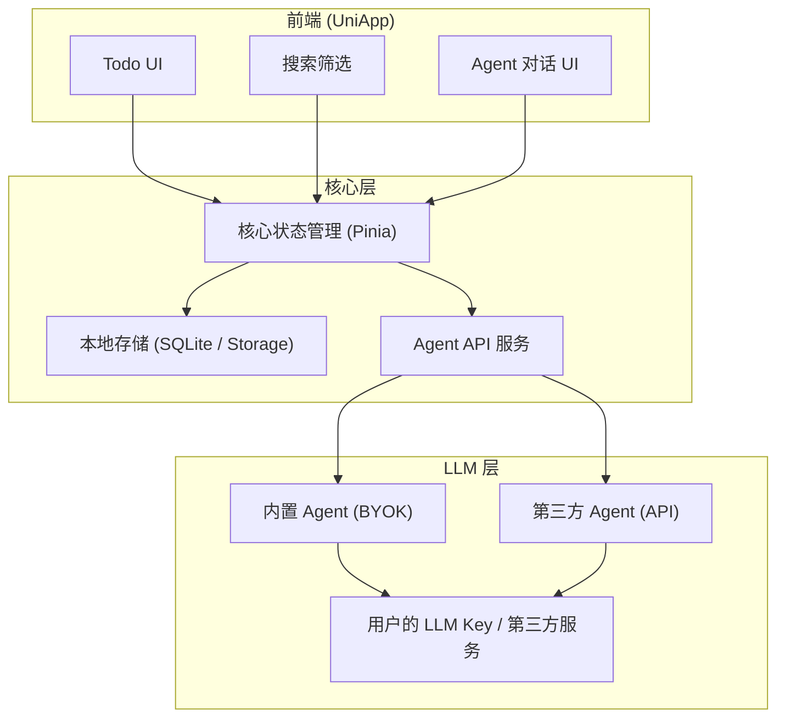

# aknirex-todo 产品愿景与需求定义

> 文档版本：v1.3 | 日期：2026-08-02 | 状态：已确认
> 修订记录：v1.1 Agent API 纳入首版、同步列入第二版、新增分享/LLM 引导/PC 端说明 | v1.2 修正愿景价值观、明确分享权限模型、修正 Agent API 架构描述 | v1.3 架构图改为 Mermaid、核心/完整 MVP 分层、新增官方中转决策点

---

## 零、原始输入
uniapp的形式，做一个todo列表软件，亮点是gui操作简单，并且暴露接口供第三方llmagent操作。第一版以微信小程序和安卓app为主。
创建todo事项，只要一行字（标题，允许为空）和优先级（有相当于中等水平的默认值，不许为空），可选地配置截止日期、自定义标签、详情字段。
todo项可以切换完成状态、编辑、删除
如果需要，可以创建新的todo列表（标题有默认值，可以为空
可以全局搜索和筛选
全局撤销
也内置byok llm agent，llm agent（无论内置还是第三方）除了基本以外操作以外还有：1.把用户输入的一段文本（如领导的任务要求、甲方的聊天记录等等）转为若干todo项。2.把软件内已有的todo总结成文本的形式，方便理清任务思路。
自由软件，但不开源，撰写公平的协议，要考虑软件拷贝本身和用户可能使用的内置或第三方agent，本软件不提供llm推理服务。

## 一、愿景声明

> ### "一句话，一件事。说进来，理出来。"
> *One line, one task. Pour in thoughts, pull out clarity.*

**核心隐喻**：aknirex-todo 不只是清单工具，而是**用户与 AI 之间的任务双向转换器**——

- **说进来**：把混乱的文字变成清晰的待办（文本 → todo）
- **理出来**：把散乱的待办整理成有结构的文本（todo → 文本）

---

## 二、核心问题

人们在微信消息、会议记录、口头交代中淹没于碎片化的任务，但现有的 todo 要么太复杂（需要学习成本），要么太简单（无 AI 辅助）。缺口在于：**记录应该瞬间完成，整理可以交给 AI，而用户始终掌控一切。**

---

## 三、目标平台

| 平台 | 优先级 | 说明 |
|------|--------|------|
| 微信小程序（手机） | P0 | 任务产生的主场景，首版必须支持 |
| 微信小程序（PC） | P0 | 同一套 UniApp 代码，PC 微信原生支持小程序，用于大屏整理 |
| Android App | P0 | 任务管理的主场景，首版必须支持 |
| iOS / Web | P1 | 后续版本扩展 |

技术方案：UniApp 跨端框架，一套代码三端入口发布（手机微信小程序、PC 微信小程序、Android App）。

---

## 四、功能需求

### 4.1 Todo 项（核心实体）

| 字段 | 必填 | 默认值 | 说明 |
|------|------|--------|------|
| 标题 | 否（允许为空） | 空 | 一行文字，快速记录 |
| 优先级 | 是 | 中等 | 高 / 中 / 低 三级 |
| 截止日期 | 否 | 空 | 可选配置 |
| 自定义标签 | 否 | 空 | 支持多个标签 |
| 详情字段 | 否 | 空 | 多行文本，补充说明 |
| 完成状态 | — | 未完成 | 可切换 |

**Todo 操作**：
- 创建
- 切换完成状态
- 编辑（所有字段均可修改）
- 删除

### 4.2 Todo 列表

| 字段 | 必填 | 默认值 | 说明 |
|------|------|--------|------|
| 列表标题 | 否 | 系统默认值 | 允许为空 |

- 可创建多个列表，按项目/场景分组
- 首版支持列表级 CRUD 即可

### 4.3 全局能力

| 功能 | 说明 |
|------|------|
| 全局搜索 | 按关键词搜索所有列表中的 todo |
| 全局筛选 | 按优先级、标签、完成状态、截止日期筛选 |
| 全局撤销 | 任何操作（创建/编辑/删除/完成）均可撤销，至少 50 步历史 |
| **分享** | 两种方式：(1) 生成**只读**小程序链接——接收者无需登录即可查看任务列表快照（不可编辑、不暴露用户身份），分享者决定有效时长（默认 1 周）；(2) 导出为纯文本/Markdown 文档，自由粘贴到聊天/邮件。**纯工具属性，无增长诱导** |

### 4.4 LLM Agent 能力（核心亮点）

#### 内置 Agent（BYOK 模式）

- **Bring Your Own Key**：用户自带 API Key，软件不提供推理服务
- 首版支持 OpenAI 兼容接口（覆盖 DeepSeek、小米 Mimo 等主流国内提供商）
- **LLM 入门引导**：为无经验用户提供 DeepSeek、小米 Mimo 等提供商的 API Key 申请与充值图文指引，降低 BYOK 使用门槛

#### Agent 双向能力

| 方向 | 能力 | 输入 | 输出 |
|------|------|------|------|
| 拆解 | 文本 → Todo | 自然语言文本（领导指示、甲方聊天记录、会议纪要等） | 结构化的若干 todo 项（含标题、优先级、标签等） |
| 总结 | Todo → 文本 | 已有 todo 列表（可选附加上下文） | 连贯的任务汇总文本（用于汇报、梳理思路、写周报等） |

#### 第三方 Agent 接口（首版开放）

- 软件暴露标准化 RESTful API，允许第三方 LLM Agent 接入
- 第三方 Agent 与内置 Agent 享有同等操作权限（Todo CRUD + 搜索筛选 + 撤销）
- 接口设计：API Key 认证 + 限流 + 操作范围声明
- 详见 [产品策略画布 §8 Capabilities](product-strategy-canvas.md#8-capabilities能力) 和 [Agent API 能力表](product-strategy-canvas.md)（API 详细设计将在技术方案中展开）

---

## 五、技术架构（初步）

> Agent API 微信小程序端技术约束：小程序不支持监听 TCP 端口。候选方向包括 WebSocket Server（uni-app 插件）、云端 Webhook 回调、或 Android 端代理，具体方案留待技术方案详设。

**关键决策**：
- 数据存储：本地优先，不依赖云端
- Agent 通信：软件本身不提供 LLM 推理服务，仅作为客户端转发
- 状态管理：全局撤销需要操作历史栈（Undo Stack，≥50 步）
- Agent API：首版即开放，RESTful + API Key 认证

---

## 六、商业模式与许可

### 6.1 定位

- **自由软件，但不开源**
- 免费使用，不收费

### 6.2 许可协议要点

协议需公平考虑以下主体：

| 主体 | 考量 |
|------|------|
| 软件本身 | 禁止未授权的商业再分发；允许个人免费使用和拷贝 |
| 内置 Agent | Agent 逻辑随软件分发，受同一协议约束 |
| 第三方 Agent | 第三方 Agent 独立于本软件，其许可由各自提供者决定；本软件不对第三方 Agent 行为负责 |
| 用户数据 | 用户数据完全归用户所有，软件不收集、不上传 |
| LLM 推理 | 软件不提供推理服务，用户自行承担 LLM 使用费用和合规责任 |

---

## 七、产品价值观

| 价值 | 表达 |
|------|------|
| **极简** | GUI 优先，所有字段都有默认值，一行字即可创建任务 |
| **双向赋能** | 不只是"记录"，更是"理解和表达"——帮你把话说清楚，也帮你想清楚 |
| **用户主权** | BYOK——用户控制自己的 AI，数据不离开用户设备 |
| **本地优先** | 所有数据存储在用户设备本地，离线全功能可用 |
| **公平** | 免费软件，公平许可，尊重创作者和使用者双方 |
| **开放生态** | 首版即暴露标准接口，第三方 Agent 可无缝接入 |

> v1.1 路线图：端到端加密跨设备同步（方案已设计），届时"本地优先"升级为"端到端加密隐私"。

---

## 八、版本范围

### 首版（MVP v1.0）

> 🔵 核心 MVP（验证 H1+H2 的最小集合） | ⚪ 完整首版（核心验证通过后的扩展）

- [ ] 🔵 Todo 项 CRUD（标题、优先级、截止日期、标签、详情）
- [ ] 🔵 完成状态切换
- [ ] 🔵 内置 BYOK Agent（文本 → Todo 拆解）
- [ ] 🔵 LLM 入门引导（DeepSeek、小米 Mimo 等 API Key 申请指引）
- [ ] 🔵 微信小程序端（手机）
- [ ] 🔵 许可协议文档
- [ ] ⚪ 多列表管理
- [ ] ⚪ 全局搜索与筛选
- [ ] ⚪ 全局撤销（≥50 步历史）
- [ ] ⚪ 内置 BYOK Agent（Todo → 文本 总结）
- [ ] ⚪ 第三方 Agent API（RESTful + API Key 认证 + 限流）
- [ ] ⚪ 分享功能（小程序链接 + 文本/文档导出）
- [ ] ⚪ 微信小程序（PC）
- [ ] ⚪ Android App 端

### 第二版（v1.1 功能更新）

- [ ] 加密中继同步（手机 ⇄ PC 微信小程序，端到端加密 WebSocket 中继）——详见 [同步方案设计](sync-design.md)
- [ ] iOS 端
- [ ] 更多 LLM 提供商适配

### 不包含（远期 / 待评估）

- [ ] 云端服务器存储/同步
- [ ] 协作/多用户功能
- [ ] Agent 插件市场
- [ ] 日历视图、甘特图
- [ ] Web 端
- [ ] 提供 LLM 推理服务

---

## 九、开放问题

| # | 问题 | 影响范围 | 建议 |
|---|------|----------|------|
| 1 | 首版支持哪些 LLM 提供商？ | Agent 模块 | 首版支持 OpenAI 兼容接口（覆盖最多提供商）（已确认） |
| 2 | 全局撤销的深度？（单步 vs 多步） | 状态管理 | 多步，至少 50 步历史（已设计，50 为估算值，上线后可根据性能调整） |
| 3 | 标签是否需要预定义，还是完全自由？ | 数据模型 | 完全自由，用户自建（已确认） |
| 4 | 许可协议是否需要法律审查？ | 合规 | 正式发布前进行法律审查 |
| 5 | Agent API 的限流策略？ | API 设计 | 按 API Key 限流，具体阈值待技术方案确定 |
| 6 | 同步中继的配对与重连机制？ | 同步（第二版） | 已输出方案，实现阶段细化。详见 [同步方案](sync-design.md) |
| 7 | 是否需要任务提醒/通知？ | 核心能力缺口 | 首版不含，v1.1 评估。详见策略画布"已知能力缺口" |
| 8 | 如果 BYOK 用户配置率低，是否提供官方付费 LLM 中转？ | 商业模式 | 首版不做，但作为正式上线前的决策点保留。若实施将修订 §6.1"免费使用，不收费"和 §6.2"不提供推理服务"两项承诺 |

---

*本文档为产品设计的起点，后续将基于此输出 PRD、技术方案和 UI 设计稿。*

*关联文档：[产品策略画布](product-strategy-canvas.md) | [同步方案设计](sync-design.md)*
