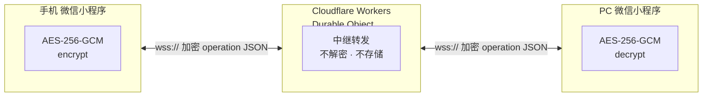
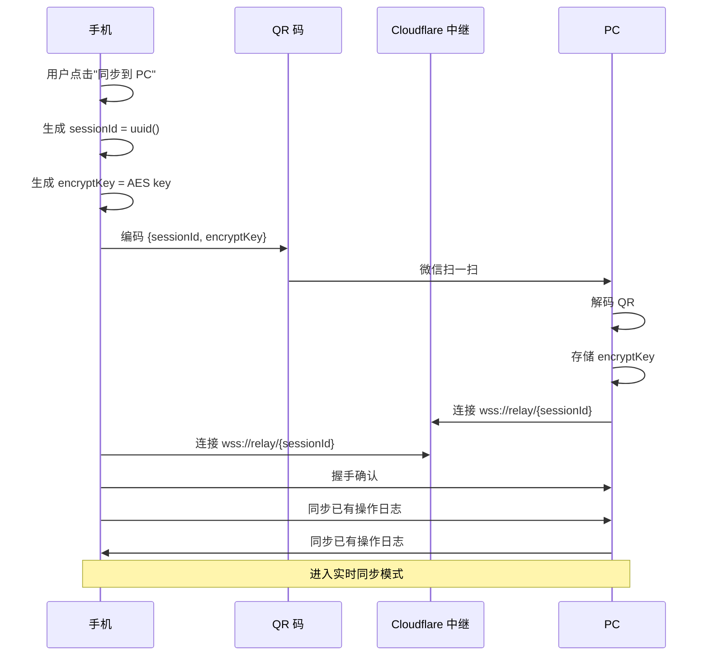
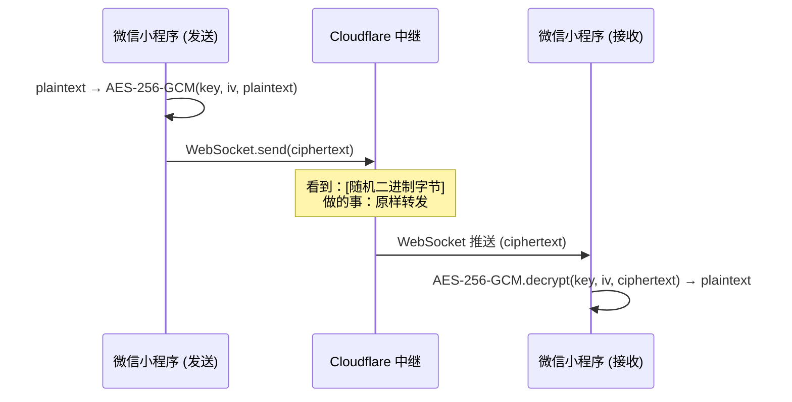

# 小程序↔小程序同步方案

> 版本：v1.2 | 日期：2026-08-02 | 状态：方案已确认，计划 v1.1 实现 | 修订：v1.1 补充安全边界 | v1.2 ASCII 图表改为 Mermaid
> 场景：手机微信小程序 ↔ PC 微信小程序，两台设备分别联网，不保证同 LAN
> 决策：**单路径——加密 WebSocket 中继。不做 LAN 直连双路径。首版 (v1.0) 不做同步，第二版 (v1.1) 实现。**

---

## 约束分析

### 微信小程序网络能力（个人主体）

| API | 可用 | 说明 |
|-----|------|------|
| `wx.connectSocket()` | ✅ | WebSocket 客户端，双向通信 |
| `wx.createUDPSocket()` | ⚠️ 需审核/企业 | 局域网 UDP，个人主体大概率不可用 |
| `wx.createTCPSocket()` | ⚠️ 需审核 | 同上 |
| `wx.startLocalServiceDiscovery()` | ✅ | mDNS 局域网发现，但不同 LAN 无效 |
| `wx.request()` | ✅ | HTTP 请求，可做轮询 |
| WebRTC | ❌ | 小程序不支持 |
| `wx.startWifi()` / WiFi 信息 | ❌ | 无法直接 |

**结论**：不同 LAN 下，微信小程序只能通过 **WebSocket** 或 **HTTP 轮询** 通信。必须有一个中继。

---

## 已排除方案：LAN 直连双路径

评估过"同 LAN 走直连、跨网走中继"的双通道方案，决定不做，理由：

| 维度 | 评估 |
|------|------|
| 延迟差异 | LAN < 10ms vs 中继 < 50ms——用户无感知 |
| 代码量 | 双路径需 +300 行（发现 + 连接 + 切换逻辑），且引入去重、重传、乱序等状态机边界 |
| API 风险 | 微信个人主体 `createUDPSocket` / `createTCPSocket` 可用性未经验证 |
| 工程优先级 | 省下的时间用于 Agent API 和 BYOK 引导，对产品价值更大 |

**结论**：首版单路径 WebSocket 中继。如果后续真实用户数据表明同步延迟 > 1 秒可感知，再评估加 LAN 通道。

---

## 方案：加密 WebSocket 中继（Cloudflare Workers + Durable Object）

### 架构



- **中继只转发 opaque ciphertext**，无数据库、无状态存储
- **AES-256-GCM 端到端加密**，密钥通过 QR 码配对时交换
- 服务端完全看不到用户数据

### 为什么不选 HTTP 轮询

| 维度 | WebSocket | HTTP 轮询 |
|------|-----------|-----------|
| 延迟 | < 100ms（推送） | 2-5 秒（取决于轮询间隔） |
| 电池/流量 | 空闲时零开销 | 持续请求 |
| 复杂度 | 连接管理 | 简单但浪费 |
| 微信限制 | `connectSocket` 最大并发 5 条 | `request` 无特殊限制 |

WebSocket 是明显更优的选择。轮询仅作为 WebSocket 连接失败的降级。

---

## 详细设计

### 1. 配对流程



### 2. 中继设计（Cloudflare Durable Object）

```js
// 一个 Durable Object 实例 = 一对设备的会话
export class SyncRelay {
  constructor(state, env) {
    this.sessions = []; // 最多 2 个 WebSocket
  }

  async fetch(request) {
    const pair = request.headers.get("Upgrade") === "websocket"
      ? new WebSocketPair()
      : null;
    // 接受 WebSocket，存储到 sessions
    // 当收到消息：解密？（不，中继不解密）→ 转发给对方
  }

  async webSocketMessage(ws, data) {
    // data 是 AES-256-GCM 密文，中继不解析
    // 找到配对的那个 ws，直接转发
    this.sessions.find(s => s !== ws)?.send(data);
  }
}
```

**为什么用 Durable Object 而非普通 Worker**：
- 普通 Worker 是无状态的，两个 WebSocket 可能落在不同实例
- Durable Object 保证同一个 sessionId 的请求路由到同一个实例
- 无需额外 KV 存储做 WebSocket 路由，架构更简单

### 3. 成本核算

Cloudflare Workers + Durable Objects 免费额：

| 资源 | 免费额度 | 估算用量（100 DAU） | 估算用量（1000 DAU） | 是否够 |
|------|----------|---------------------|----------------------|--------|
| Worker 请求 | 10 万/天 | ~1,000/天 | ~10,000/天 | ✅ |
| Durable Object 请求 | 100 万/月 | ~3 万/月 | ~30 万/月 | ✅ |
| DO 存储 | 1 GB | ~0（不存数据） | ~0 | ✅ |
| CPU 时间 | 10ms/请求 | < 1ms/请求 | < 1ms/请求 | ✅ |

计算假设（100 DAU）：
- 每用户每天 10 次操作
- 每次操作产生 1 条同步消息 → 中继转发 2 次（发送方向 + 接收方向）
- 100 × 10 × 2 = 2,000 条消息/天 ≈ 3,000 Durable Object 请求/天（含连接建立/心跳）≈ 9 万/月

1000 DAU 场景：约 90 万 DO 请求/月，仍在免费额度内。突破 100 万/月后费用约 $0.15/百万请求 ≈ ¥0.15/天。

**结论：1,000 DAU 以内完全免费。万级 DAU 时月度费用约 ¥10-30，仍可接受。**

### 4. 安全模型



- **密钥**：配对时通过 QR 码交换，仅存在于两台设备
- **IV/Nonce**：每次消息生成随机 nonce，防重放
- **完整性**：GCM 自带认证标签，篡改可检测
- **中继风险**：即使 Cloudflare 被攻破，攻击者只能看到加密的二进制数据

### 已知安全边界（实现阶段须解决）

| 问题 | 风险 | 实现方向 |
|------|------|----------|
| sessionId 泄露 = 会话劫持 | QR 码被截屏/拍照后，攻击者可连接同一 session | QR 码加入一次性 token；sessionId 仅用于路由，实际连接需额外认证握手 |
| 无前向保密（Forward Secrecy） | 长期密钥泄露 → 所有历史消息可解密 | 实现阶段评估 Signal 协议风格的 ratchet，或简化为定期密钥轮换（如每 session 重新生成） |
| 重放攻击（Replay） | 攻击者录制密文并重放，可能触发重复操作 | 每条消息带单调递增序列号（seq），接收端丢弃 seq ≤ 已见最大值的消息 |
| 元数据泄露 | 中继可观察消息大小和时序 | 填充（padding）使每条消息等长；但这增加带宽，首版可接受此风险 |

> 上述问题将在 v1.1 技术方案详设阶段给出最终方案。当前策略层面确认风险可接受，不会成为同步功能的 blocker。

---

## 权衡与边界

### 此方案的代价

| 代价 | 应对 |
|------|------|
| 需要部署 Worker 代码 | 约 150 行 JS，一次性工作 |
| 依赖 Cloudflare | 可随时迁移到其他 WebSocket 服务（任何支持 WS 的 PaaS） |
| 首次配对需扫码 | 一次性的，后续自动重连 |
| 如果中继挂了 | 两端各自本地完整可用，只是暂时不同步。重连后自动追赶 |

### 可以省略的部分（首版不做）

- ❌ **在线状态指示**（"对方在线"）——操作到达即为在线，用户不需要感知
- ❌ **离线队列**（中继侧存储未送达消息）——如果对方不在线，发送方本地保留，等对方重连后 WebSocket 推送
- ❌ **多设备**（超过 2 台）——首版只有手机+PC，一对一
- ❌ **同步冲突解决 UI**——单用户场景，LWW 自动处理

### 核心简化原则

只有两个设备，一个 session。这比一般"同步"问题简单得多：

- 没有多写者并发
- 没有拓扑管理
- 没有权限模型
- 没有"部分同步"（一个用户不可能只同步某几个列表）

可以把这个当成**操作日志的单向追加 + 双向推拉**，而不是分布式一致性系统。

---

*本方案已确认，计划在 v1.1 实现。首版 (v1.0) 架构已通过 Undo Stack 操作日志预留同步接口。实现细节将在 v1.1 技术方案文档中展开。*
